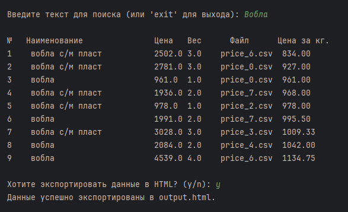
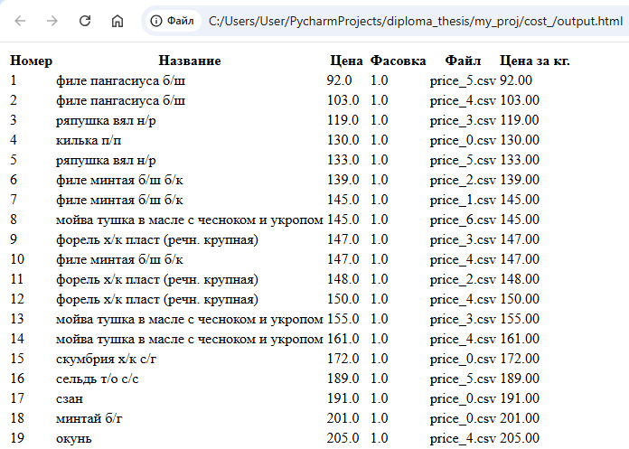

# PriceMachine

PriceMachine — это Python-приложение для загрузки, обработки и поиска ценовых данных из CSV файлов. Программа позволяет находить товары по заданному тексту и экспортировать результаты в HTML-формате.

## Описание

Приложение автоматически загружает данные о товарах из CSV файлов, содержащих "price" в имени, из указанной папки. Оно обрабатывает данные о названии, цене, весе и вычисляет цену за килограмм для каждого товара. Пользователь может выполнять поиск по названию товара и экспортировать результаты в HTML.

## Установка

1. Убедитесь, что у вас установлен Python (версии 3.6 и выше).
2. Склонируйте репозиторий или скачайте файлы проекта.

## Использование

1. Запустите приложение:
2. Программа предложит ввести текст для поиска товаров. Введите текст и нажмите Enter.

3. Если товары найдены, вы сможете экспортировать данные в HTML, ответив 'y' на соответствующий запрос.

4. После успешного экспорта, вы будете автоматически перенаправлены на файл output.html

